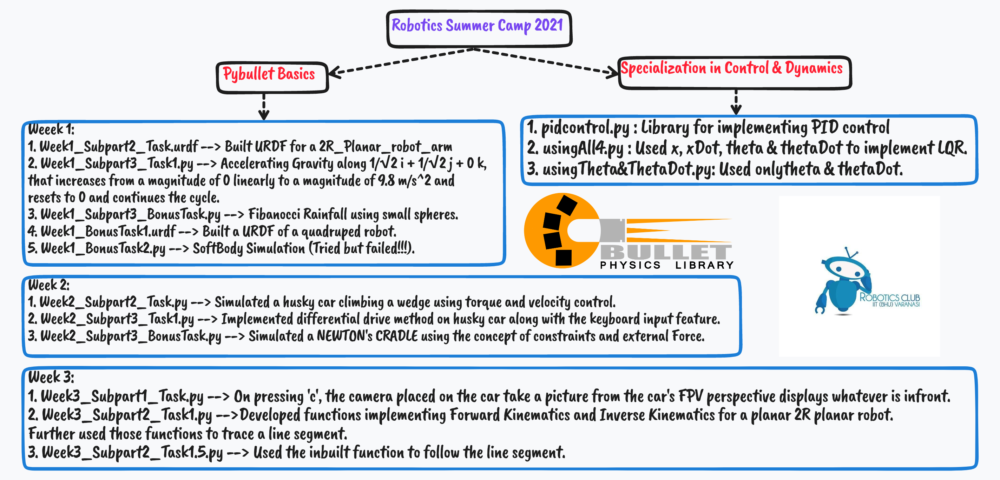

### My approach for the tasks given in Robotics Summer Camp 2021 organised by Robotics Club, IIT (BHU) Varanasi.

If you are interesed to learn, links to some amazing resources:

[Robotics Summer Camp'21](https://github.com/Robotics-Club-IIT-BHU/Robotics-Camp-2021)

[Controls & Dynamics Summer Camp'21](https://github.com/Robotics-Club-IIT-BHU/CnD-SummerCamp21)

[Controls Bootcamp by Steve Brunton](https://youtube.com/playlist?list=PLMrJAkhIeNNR20Mz-VpzgfQs5zrYi085m)