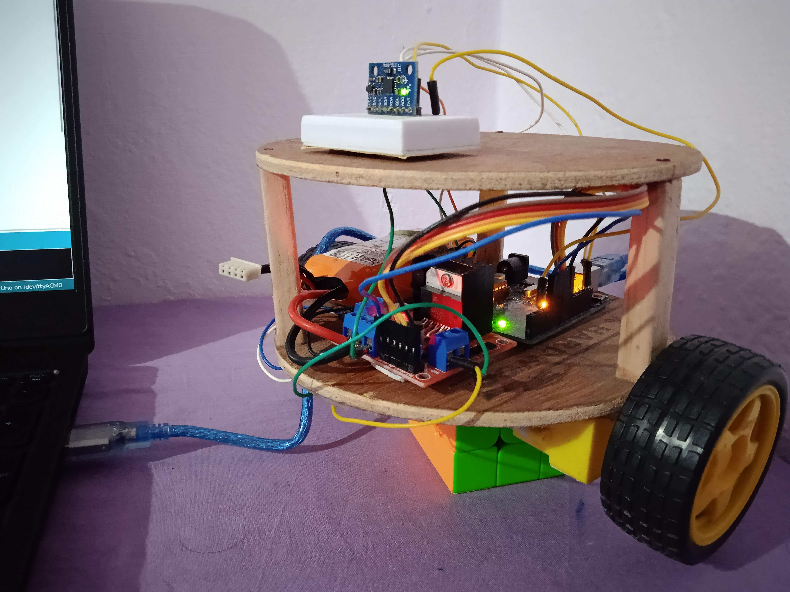

## My approach for the tasks given in Robotics Summer Camp 2021

### Videos of some final results:

|  |  |
|----------------------------------------|-----------------------------------------|
||  |

## Self Balancing Bot Simulation in Pybullet

## Fabricating a self-balancing bot

## Resources:

[Robotics Summer Camp'21](https://github.com/Robotics-Club-IIT-BHU/Robotics-Camp-2021)

[Controls & Dynamics Summer Camp'21](https://github.com/Robotics-Club-IIT-BHU/CnD-SummerCamp21)

[Controls Bootcamp by Steve Brunton](https://youtube.com/playlist?list=PLMrJAkhIeNNR20Mz-VpzgfQs5zrYi085m)
